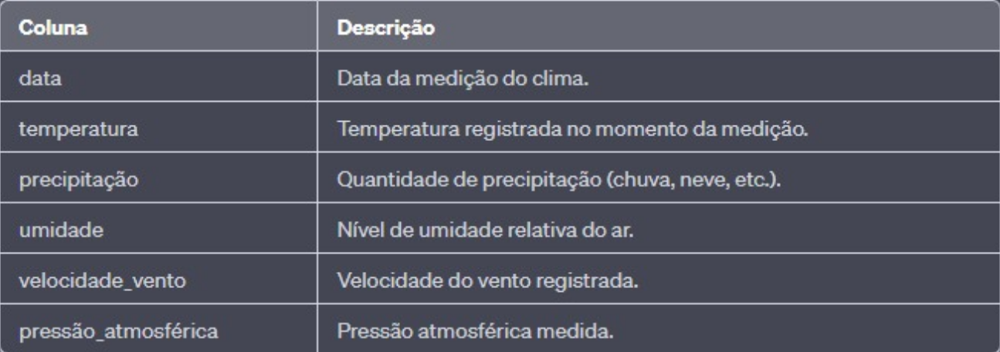

# Análise de Dados Exploratória de dados climáticos

<h1>1. Introdução</h1>

A análise exploratória de dados climáticos permite identificar padrões e tendências relacionados ao clima. Essa análise é crucial para compreender o clima global e suas implicações em áreas como agricultura, planejamento urbano e previsão de desastres naturais. Ao analisar dados de temperatura, precipitação, umidade e outros fatores climáticos, é possível identificar padrões sazonais, eventos extremos e mudanças de longo prazo. Essa análise desempenha um papel importante na avaliação das mudanças climáticas e na implementação de estratégias de adaptação. Neste trabalho, faremos uma análise exploratória de dados climáticos para obter insights sobre as características do clima.

<h2>1.1 Objetivos</h2>

Os objetivos da análise exploratória de dados climáticos podem variar dependendo do contexto específico do estudo. No entanto, aqui estão alguns objetivos comuns que podem ser perseguidos durante essa análise:

1. Padrões sazonais de temperatura e precipitação.
2. Tendências de longo prazo nas mudanças climáticas.
3. Eventos climáticos extremos e sua frequência.
4. Correlações entre variáveis climáticas.

<h1>2. Metodologia </h1>

Nesta seção, será apresentado o processo de preparação, organização e limpeza 
de dados climáticos, considerando o seguinte conjunto de dados:

<h2>Observações</h2>

A coluna "temperatura" pode ser registrada em graus Celsius (°C) ou Fahrenheit (°F), dependendo da fonte dos dados.
A coluna "precipitação" pode ser registrada em milímetros (mm) ou polegadas (in), dependendo da fonte dos dados.
O nível de umidade relativa do ar é expresso em porcentagem (%).
A velocidade do vento pode ser registrada em quilômetros por hora (km/h) ou metros por segundo (m/s), dependendo da fonte dos dados.
A pressão atmosférica pode ser registrada em hectopascais (hPa) ou quilopascais (kPa), dependendo da fonte dos dados.
É importante considerar qualquer pré-processamento necessário nos dados, como tratamento de valores ausentes, detecção e remoção de outliers, normalização de unidades, etc.
A fonte dos dados climáticos deve ser mencionada para garantir a confiabilidade e rastreabilidade das informações utilizadas na análise.
Com base nessas observações, é possível realizar a preparação dos dados climáticos antes de realizar a análise exploratória.

# Referências

Organizações meteorológicas nacionais, como o Instituto Nacional de Meteorologia (INMET) no Brasil, o National Weather Service (NWS) nos Estados Unidos, o Met Office no Reino Unido, entre outros.

Organizações internacionais, como a Organização Meteorológica Mundial (OMM) e a Administração Oceânica e Atmosférica Nacional (NOAA) dos Estados Unidos.

Provedores de serviços climáticos online, como o Weather Underground, AccuWeather, Weather.com, entre outros.

Bancos de dados climáticos, como o Climate Data Online (CDO) da NOAA, o Climate Data Store (CDS) do Copernicus Climate Change Service, entre outros.
